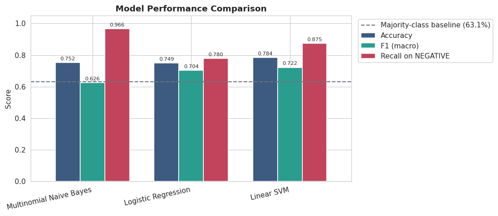
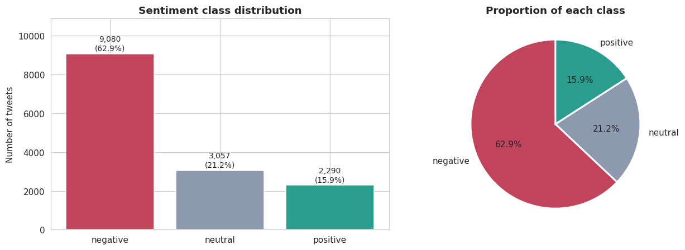
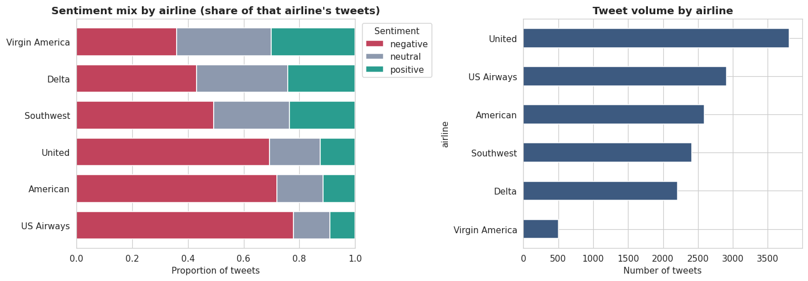
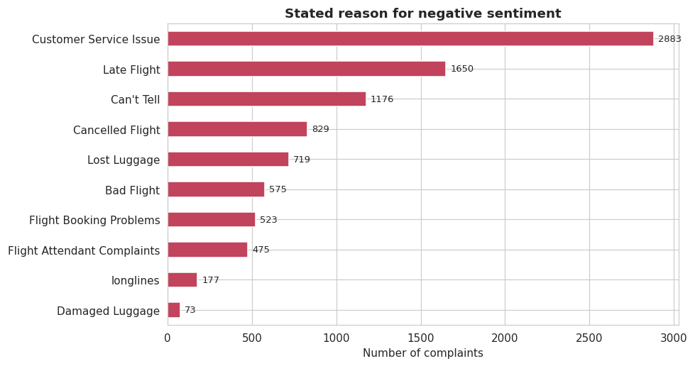
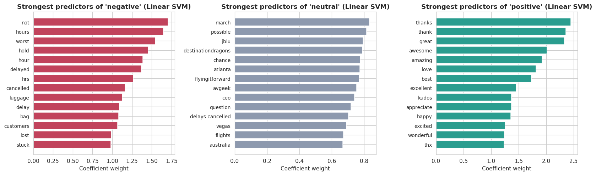
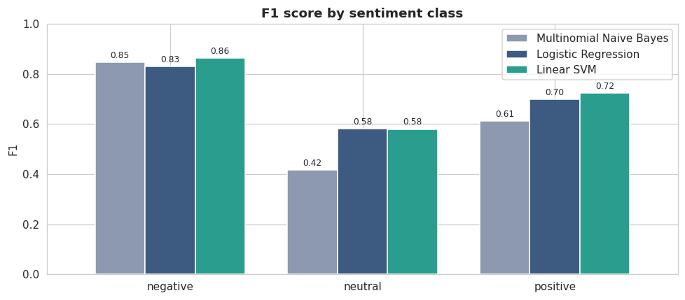
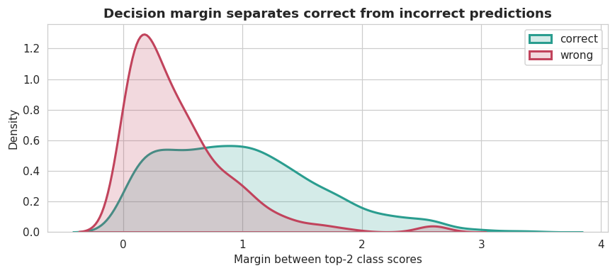

# Airline Tweet Sentiment Analysis

**Three-class sentiment classification on 14,427 airline customer tweets, built as a complaint-triage system.**

[](https://www.python.org/)
[](https://scikit-learn.org/)
[](LICENSE)
[](https://colab.research.google.com/github/krhys-killingsworth/ITAI-1371-ML-Labs/blob/main/airline-sentiment-analysis/notebooks/FP_AirlineTweets_KrhystopherKillingsworth.ipynb)

---

## The headline result

**A model that "won" my chosen business metric turned out to be the worst model for the job, and finding that was the point.**

I set out with a clear, defensible metric. Airlines lose customers when complaints go unanswered, so I decided up front that **recall on the negative class** was what mattered: missing a real complaint is expensive, over-flagging a neutral tweet costs an agent thirty seconds.

Multinomial Naive Bayes then posted **96.6% recall on complaints**, the best number in the entire study.

It got there by predicting "negative" at almost everything. Its recall on neutral tweets collapsed to 30%, and its macro F1 was the worst of any real model. As a triage system it would have flagged most of the inbox and given the support team no prioritization at all.

I only caught it because I had paired the business metric with **macro F1** as a guard, a metric that cannot be gamed the same way. With one number, I would have shipped the wrong model.

| Model | Accuracy | Macro F1 | Recall on complaints | Complaints missed | Neutral over-flagged |
|---|---|---|---|---|---|
| Baseline (majority class) | 0.631 | 0.258 | 1.000 | 0.0% | 100% |
| Multinomial Naive Bayes | 0.752 | 0.626 | **0.966** | 3.4% | 62.8% |
| Logistic Regression | 0.749 | 0.704 | 0.780 | 22.0% | 22.1% |
| **Linear SVM** *(recommended)* | **0.784** | **0.722** | 0.875 | 12.5% | 34.2% |

The three real models sit at three points on the *same* tradeoff curve. No model is strictly better. The business cost structure picks the setting. Since missed complaints are the expensive error, the right choice is on the recall side of balanced, which is where Linear SVM sits and Logistic Regression does not.



---

## The business problem

Airlines receive enormous volumes of public, unstructured feedback on social media. A single unanswered complaint is visible to everyone, and response speed strongly influences whether a frustrated passenger escalates or lets it go. Reading every mention by hand does not scale.

This project builds a classifier to support two decisions:

1. **Real-time triage.** Route predicted-negative tweets to a priority support queue.
2. **Root-cause reporting.** Aggregate sentiment by airline and complaint reason for a weekly operations dashboard.

---

## What the data says

**63% of airline tweets are negative**, outnumbering positive ones nearly four to one. That ratio says more about the medium than about airline quality, since people go to Twitter to complain, but it sets a brutal analytical trap: *a model that predicts "negative" every single time scores 63% accuracy while doing no work at all.* Every number in this project is measured against that floor.



**Sentiment varies enormously by carrier,** from 36% negative for Virgin America to 78% for US Airways. This is a real finding *and* a modeling hazard, discussed under "Design decisions" below.



**Customer service issues are the single largest complaint driver** (~32%), ahead of late flights (~18%). The strategic implication is worth stating plainly: a large share of public anger is generated not by the operational failure itself but by *how the airline responded* to it, and response quality is far cheaper to fix than fleet scheduling.



---

## Design decisions

Three choices did more for the quality of this model than any hyperparameter.

### 1. Removing airline handles, a feature that would have *raised* my score

Nearly every tweet opens with the airline's handle, and sentiment correlates strongly with carrier. Leaving `@usairways` in the text lets the model learn **"this mentions US Airways, therefore probably negative."**

That is a real statistical pattern and it would have improved my test metrics. It is also not sentiment analysis. It would fail on a compliment to US Airways and be useless for a carrier with no prior distribution. I removed the handles and verified in the coefficient plot that no airline name appears among the learned features.

### 2. Preserving negation through stopword removal

Standard stopword lists strip "not," "no," "never." For sentiment analysis this is destructive: *"not a good flight"* and *"a good flight"* become the identical bag of words.

I subtracted a negation set from scikit-learn's stopword list before applying it. Combined with bigrams in the vectorizer, this lets the model learn `not good` as its own feature. It paid off, and `not` ends up as one of the strongest negative predictors.

### 3. Splitting before vectorizing

`TfidfVectorizer` learns vocabulary *and* IDF weights from whatever it is fit on. Fitting it on the full dataset leaks test-set vocabulary distribution into training. The vectorizer is fit on the training fold only. Duplicate tweets are also dropped *before* the split so near-identical rows cannot straddle the boundary.

---

## What the model actually learned



The negative and positive columns are exactly what you'd hope: operational failure language (*cancelled, delayed, hours, stuck, lost, luggage*) and gratitude (*thanks, great, awesome, best, wonderful*). No airline name appears anywhere, so the handle-stripping worked.

**But the neutral column is a problem.** Its top features are city names, campaign hashtags, and topical fragments, not sentiment words at all. The model isn't detecting "this tweet lacks sentiment"; it's detecting "this is about a promo or a specific city, and those tend to be labeled neutral."

That's a spurious correlation of the same kind I deliberately removed for airline handles, and it survived because I didn't anticipate it. It means **real-world neutral performance would be worse than the test score suggests**, since a February 2015 promo hashtag has no predictive value in any other month.

**Nothing in the confusion matrix or F1 table would have revealed this.** It took reading the coefficients.



---

## Error analysis: the model reads "no thanks" as positive

The most confident mistakes are short replies labeled neutral and predicted positive, including *"no thanks"* and *"no thank you."*

This is instructive precisely because I *did* preserve negation in preprocessing. The negation word survives cleaning; the problem is that `thanks` is such a strong positive feature that the rare `no thanks` bigram can't outweigh it. **Preserving negation was necessary but not sufficient.** The fix isn't more cleaning; it's a model that can represent word order and scope at all.

Other documented failure modes: sarcasm (*"Great, another delay"*), mixed sentiment in one tweet, emoji-carried meaning stripped during cleaning, and context-free fragments.

### The margin is a usable routing signal

`LinearSVC` gives a decision margin rather than probabilities, and that margin separates correct from incorrect predictions cleanly:

| Confidence band | Accuracy |
|---|---|
| Top 10% most confident | 96.5% |
| Top 25% most confident | 95.7% |
| Top 50% most confident | 91.9% |
| Bottom 25% least confident | 58.2% |



This is the most deployable finding here: **auto-route the confident predictions, send the low-margin tail to human review, and feed those human decisions back as training data.** It converts a model weakness into a workflow feature and generates labels from work the team was already doing.

It also partly rescues the sarcasm problem. The model can't detect irony, but it often detects that it's *unsure*, and the sarcastic test case lands in exactly the low-margin band that would route to a human.

---

## Quickstart

```bash
git clone https://github.com/krhys-killingsworth/ITAI-1371-ML-Labs.git
cd airline-sentiment-analysis
pip install -r requirements.txt
```

**Reproduce the full model comparison:**

```bash
python src/sentiment_pipeline.py --report results/metrics.csv
```

**Classify text from the command line:**

```bash
python src/sentiment_pipeline.py --predict "3 hour delay and nobody would help"
# [NEGATIVE margin 2.30] 3 hour delay and nobody would help  -> PRIORITY SUPPORT QUEUE
```

**Use it as a library:**

```python
from src.sentiment_pipeline import SentimentPipeline

pipe = SentimentPipeline().fit()
pipe.predict(["my bag never arrived"])              # ['negative']
pipe.predict_with_confidence(["thanks!"])           # [('positive', 2.25)]
pipe.evaluate()                                     # full classification report
```

**Or open the notebook**, which contains the complete analysis and reasoning: [`notebooks/FP_AirlineTweets_KrhystopherKillingsworth.ipynb`](notebooks/FP_AirlineTweets_KrhystopherKillingsworth.ipynb)

The dataset loads from a public URL, so no manual download is required. Full pipeline runs in roughly two minutes on CPU.

---

## Repository structure

```
airline-sentiment-analysis/
├── notebooks/
│   └── FP_AirlineTweets_KrhystopherKillingsworth.ipynb   # Full analysis, 6 parts
├── src/
│   └── sentiment_pipeline.py                             # Reusable pipeline + CLI
├── figures/                                              # Exported plots
├── results/
│   └── metrics.csv                                       # Model comparison output
├── docs/
│   └── methodology.md                                    # Decisions and rationale
├── requirements.txt
├── LICENSE
└── README.md
```

---

## Method

| Stage | Approach |
|---|---|
| **Data** | Twitter US Airline Sentiment. 14,640 tweets (Feb 2015), 14,427 after de-duplication |
| **Cleaning** | HTML entity decoding, URL/mention removal, lowercasing, digit and punctuation stripping, elongation collapsing, negation-preserving stopword removal |
| **Features** | TF-IDF, 5,000 features, unigrams + bigrams, `min_df=2`, `max_df=0.9`, sublinear TF |
| **Split** | 80/20 stratified, seed 42, vectorizer fit on training fold only |
| **Imbalance** | `class_weight='balanced'` on LR and SVM (MNB has no equivalent, shown deliberately) |
| **Selection** | 5-fold stratified CV on macro F1, then grid search on `C` |
| **Evaluation** | Accuracy, per-class precision/recall/F1, macro F1, confusion matrices, coefficient inspection, error analysis, confidence-band simulation |

**Reproducibility note:** figures in this README come from the reference run in `results/metrics.csv`. Exact digits shift by roughly ±0.5% across scikit-learn versions (the notebook's Colab run gives 78.7% accuracy and 0.726 macro F1 for the recommended model), and the grid search occasionally selects a neighboring `C` for Logistic Regression. No conclusion in this project depends on those decimals.

**Tuning note:** at default settings Logistic Regression edged out Linear SVM in cross-validation. The SVM only overtook it after tuning, because its default `C=1.0` was badly over-fit for 5,000 sparse features and its optimum sits at `C=0.1`. An untuned comparison would have pointed at the wrong model.

---

## Limitations

Stated plainly, because they matter more than the score:

- **A one-week snapshot from February 2015.** US Airways and Virgin America no longer exist as separate brands. Performance on current tweets would degrade without retraining.
- **The neutral class is partly learned from spurious topical features** (see above). This is the limitation I'd weigh most heavily, since real-world neutral performance is likely worse than reported.
- **No sarcasm handling, incomplete negation handling.** Architectural limits of bag-of-words, not tuning problems.
- **Crowd-sourced labels with low agreement on neutral**, setting an irreducible noise floor. Low-confidence rows were deliberately *not* filtered, since a deployed model has to handle ambiguous tweets.
- **English-only, US-carrier-only, Twitter-only.** Nothing here is validated beyond that.
- **The recommended model still misses ~12.5% of complaints.** Acceptable for prioritization where a human eventually reviews the low-priority queue; **not** acceptable for a system that discards non-negative tweets.

---

## Next steps

1. **Fine-tune a transformer** (DistilBERT / Twitter-RoBERTa). Contextual embeddings read word order and would directly attack the sarcasm and negation ceiling. Largest expected gain.
2. **Aspect-based sentiment.** Extract sentiment per aspect (crew, punctuality, baggage) instead of one label per tweet. Solves mixed sentiment and produces a far more actionable dashboard.
3. **Confidence-threshold routing with an active learning loop,** the highest-value change relative to effort.
4. **Reframe as binary "complaint / not a complaint"** if triage is the only requirement. Neutral isn't a coherent linguistic category here; collapsing it removes the problem rather than modeling it.
5. **Strip campaign hashtags and place names** as an immediate mitigation for the spurious neutral features.

---

## What I took away from this

**A metric chosen for good business reasons is still gameable, and it needs a guard.** My reasoning in favor of negative-class recall was sound. A real model then gamed it by doing something useless, and only the guard metric caught it. The discipline isn't picking a better metric. It's deciding *before* you see results what your metric's failure mode would look like, then checking for it specifically.

**Two of the three most important findings here are invisible in any score table.** That the model reads "no thanks" as positive, and that it identifies neutral tweets by city names, both came from reading the model's actual output rather than its metrics.

---

## Acknowledgments

Dataset originally collected by CrowdFlower (now Appen) and distributed via Kaggle as *Twitter US Airline Sentiment*.

Built as the final project for **ITAI 2372** at Houston Community College.

## License

MIT. See [LICENSE](LICENSE).
